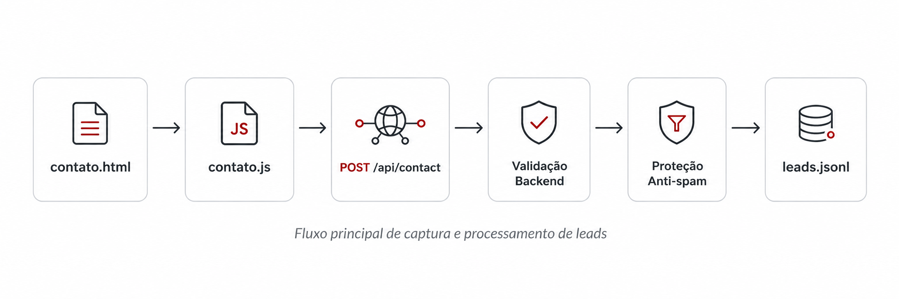
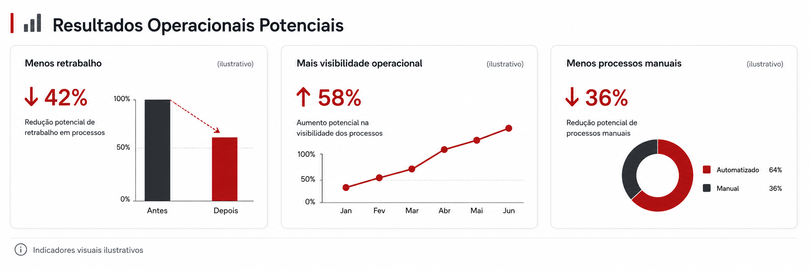

<p align="center">
  
</p>

<h1 align="center">Mercur Unified Systems Corporation</h1>

<p align="center">
  Landing page institucional com backend de captura de leads para solicitação de demonstrações.
</p>

<p align="center">
  
  
  
  
  
</p>

---

## Visão Geral

A **Mercur Unified Systems Corporation** é uma landing page institucional desenvolvida para apresentar uma proposta de valor focada em **unificação de sistemas**, **automação inteligente**, **orquestração de dados** e **infraestrutura modular** para empresas modernas.

O projeto foi construído com uma abordagem direta, técnica e profissional, mantendo o frontend em **HTML, CSS e JavaScript puro**, enquanto o backend utiliza **Node.js com Express** para receber e processar solicitações do formulário de contato/demonstração.

O formulário da página `contato.html` captura leads interessados em iniciar um diagnóstico operacional, valida os dados no frontend e no backend, aplica proteção básica contra spam e registra os envios em um arquivo local estruturado.

---

## Stack

### Frontend

* HTML5
* CSS3
* JavaScript Vanilla
* Layout responsivo
* Interface institucional com linguagem visual técnica

### Backend

* Node.js
* Express
* CORS
* Dotenv
* Nodemailer
* Express Rate Limit
* Armazenamento local em JSONL

---

## Arquitetura do Formulário

<p align="center">
  
</p>

---

## Fluxo Operacional

```txt
Usuário preenche o formulário
↓
contato.js captura os dados
↓
fetch envia para http://localhost:3000/api/contact
↓
Express recebe a requisição
↓
Backend valida os campos
↓
Rate limit e honeypot reduzem spam
↓
Lead é salvo em backend/data/leads.jsonl
↓
Envio por e-mail fica preparado para configuração SMTP futura
```

---

## Estrutura de Pastas

```txt
MERCUR-PROJECT/
├── assets/
│   └── readme/
│       ├── mercur-readme-banner.png
│       ├── arquitetura-formulario.png
│       └── resultados-operacionais.png
├── backend/
│   ├── controllers/
│   │   └── contact.controller.js
│   ├── middleware/
│   │   ├── contact-rate-limit.js
│   │   └── validate-contact.js
│   ├── routes/
│   │   └── contact.routes.js
│   ├── services/
│   │   ├── lead-storage.service.js
│   │   └── mail.service.js
│   ├── data/
│   │   └── .gitkeep
│   ├── .env.example
│   ├── README.md
│   ├── package.json
│   ├── package-lock.json
│   └── server.js
├── contato.html
├── contato.js
├── index.html
├── script.js
├── style.css
├── README.md
└── .gitignore
```

---

## Como Rodar Localmente

### 1. Clonar o projeto

```bash
git clone <url-do-repositorio>
cd Mercur-project
```

### 2. Instalar as dependências do backend

```bash
cd backend
npm install
```

### 3. Configurar variáveis de ambiente

Crie um arquivo `.env` dentro da pasta `backend` com base no arquivo `.env.example`.

```env
PORT=3000

SMTP_HOST=
SMTP_PORT=587
SMTP_USER=
SMTP_PASS=

MAIL_FROM=
MAIL_TO=
```

O envio por e-mail é opcional neste estágio. Mesmo sem SMTP configurado, o backend continua salvando os leads localmente.

### 4. Rodar o backend

```bash
npm start
```

Se tudo estiver correto, o terminal exibirá:

```txt
Backend Mercur rodando em http://localhost:3000
```

### 5. Abrir o frontend

Abra o arquivo `index.html` ou `contato.html` no navegador.

Durante o desenvolvimento local, o formulário envia os dados para:

```txt
http://localhost:3000/api/contact
```

---

## Endpoint Principal

### `POST /api/contact`

Recebe os dados do formulário de contato/demonstração.

#### Campos esperados

```json
{
  "name": "Nome do usuário",
  "company": "Nome da empresa",
  "email": "email@empresa.com",
  "phone": "(00) 00000-0000",
  "operation": "sistemas-desconectados",
  "message": "Mensagem enviada pelo usuário",
  "website": ""
}
```

O campo `website` é usado como **honeypot** para proteção básica contra spam.

---

## Validações Implementadas

O backend valida:

* campos obrigatórios;
* formato de e-mail;
* tamanho máximo dos campos;
* opções válidas no campo de problema operacional;
* honeypot contra robôs;
* limite de envios por IP;
* payload JSON com limite de tamanho.

---

## Armazenamento de Leads

Os leads são salvos localmente em:

```txt
backend/data/leads.jsonl
```

Cada linha representa um lead em formato JSON.

Exemplo:

```json
{"name":"Rafael","company":"Mercur","email":"teste@email.com","phone":"11999999999","operation":"sistemas-desconectados","message":"Teste","createdAt":"2026-05-28T01:00:00.000Z"}
```

Por conter dados sensíveis de contatos, esse arquivo é ignorado pelo Git.

---

## Resultados Operacionais Potenciais

<p align="center">
  
</p>

> Indicadores visuais ilustrativos. Os resultados reais dependem do contexto, maturidade operacional, processos existentes e integrações de cada empresa.

---

## Segurança e Boas Práticas

O projeto já inclui práticas iniciais importantes:

* `.env` fora do versionamento;
* `node_modules` ignorado pelo Git;
* arquivo local de leads ignorado;
* `.env.example` como modelo público;
* separação entre frontend e backend;
* validação no servidor;
* proteção básica contra spam.

Arquivos que não devem ser enviados para o GitHub:

```txt
backend/.env
backend/data/leads.jsonl
backend/node_modules/
```

---

## Status do Projeto

| Área                         | Status                             |
| ---------------------------- | ---------------------------------- |
| Landing page principal       | Aprovada visualmente               |
| Página de contato            | Estruturada                        |
| Formulário                   | Integrado ao backend               |
| Backend Express              | Implementado                       |
| Validação backend            | Implementada                       |
| Proteção anti-spam           | Implementada                       |
| Armazenamento local de leads | Implementado                       |
| Envio por e-mail             | Preparado, aguardando SMTP oficial |
| Deploy                       | Pendente                           |

---

## Próximas Etapas

* Configurar e-mail oficial da Mercur.
* Ativar envio real de notificações por SMTP.
* Preparar deploy do frontend.
* Hospedar o backend em ambiente próprio.
* Avaliar banco de dados para substituir o arquivo local JSONL.
* Integrar futuramente com CRM ou ferramenta de automação comercial.

---

## Sobre a Mercur

A **Mercur Unified Systems Corporation** é posicionada como uma camada inteligente de infraestrutura para empresas modernas, conectando sistemas, fluxos, dados e automações em uma arquitetura operacional mais clara, integrada e escalável.
